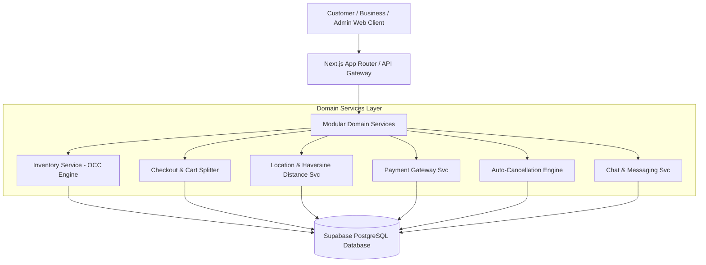

# 01 - System Overview Diagram

```mermaid
graph TD
    Client[Customer / Business / Admin Web Client] --> Gateway[Next.js App Router / API Gateway]
    Gateway --> Services[Modular Domain Services]
    
    subgraph Domain Services Layer
        Services --> InvSvc[Inventory Service - OCC Engine]
        Services --> ChkSvc[Checkout & Cart Splitter]
        Services --> LocSvc[Location & Haversine Distance Svc]
        Services --> PaySvc[Payment Gateway Svc]
        Services --> CancSvc[Auto-Cancellation Engine]
        Services --> ChatSvc[Chat & Messaging Svc]
    end

    InvSvc --> Database[(Supabase PostgreSQL Database)]
    ChkSvc --> Database
    LocSvc --> Database
    PaySvc --> Database
    CancSvc --> Database
    ChatSvc --> Database
```
