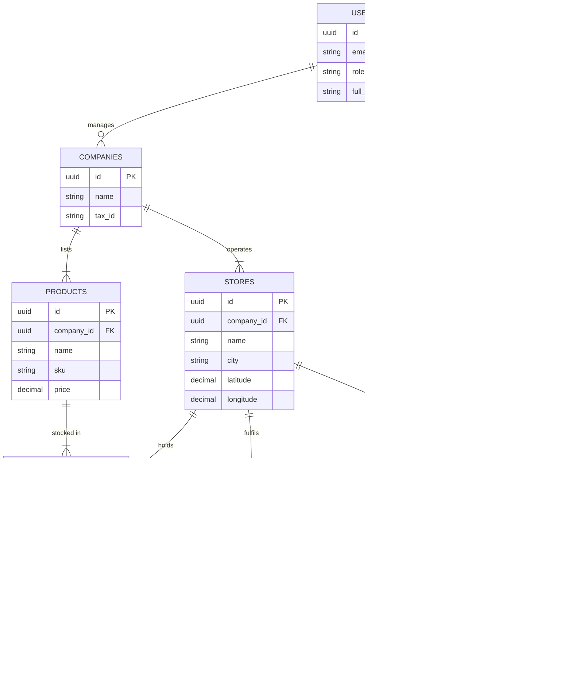

# 02 - Database ERD Schema Diagram

```mermaid
erDiagram
    USERS ||--o{ COMPANIES : "manages"
    COMPANIES ||--|{ STORES : "operates"
    COMPANIES ||--|{ PRODUCTS : "lists"
    STORES ||--|{ STORE_INVENTORY : "holds"
    PRODUCTS ||--|{ STORE_INVENTORY : "stocked in"
    USERS ||--o{ ORDERS : "places"
    STORES ||--o{ ORDERS : "fulfils"
    ORDERS ||--|{ ORDER_ITEMS : "contains"
    ORDERS ||--o{ INVENTORY_RESERVATIONS : "reserves"
    ORDERS ||--o{ PAYMENTS : "billed via"
    USERS ||--o{ CONVERSATIONS : "initiates"
    STORES ||--o{ CONVERSATIONS : "responds to"
    CONVERSATIONS ||--|{ CHAT_MESSAGES : "contains"

    USERS {
        uuid id PK
        string email
        string role
        string full_name
    }

    COMPANIES {
        uuid id PK
        string name
        string tax_id
    }

    STORES {
        uuid id PK
        uuid company_id FK
        string name
        string city
        decimal latitude
        decimal longitude
    }

    PRODUCTS {
        uuid id PK
        uuid company_id FK
        string name
        string sku
        decimal price
    }

    STORE_INVENTORY {
        uuid id PK
        uuid store_id FK
        uuid product_id FK
        integer available_quantity
        integer reserved_quantity
        integer version
    }
```
