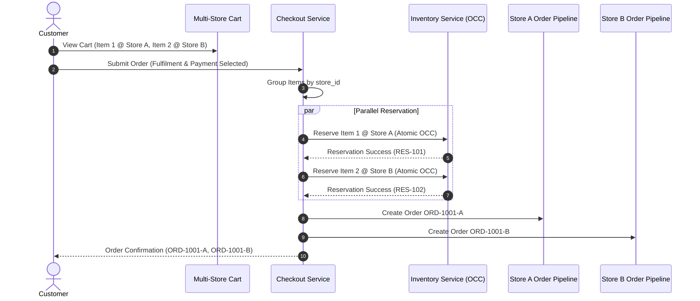

# 03 - Multi-Store Cart Checkout & Order Splitting Flow

```mermaid
sequenceDiagram
    autonumber
    actor Customer
    participant Cart as Multi-Store Cart
    participant Checkout as Checkout Service
    participant Inv as Inventory Service (OCC)
    participant StoreA as Store A Order Pipeline
    participant StoreB as Store B Order Pipeline

    Customer->>Cart: View Cart (Item 1 @ Store A, Item 2 @ Store B)
    Customer->>Checkout: Submit Order (Fulfilment & Payment Selected)
    Checkout->>Checkout: Group Items by store_id
    
    par Parallel Reservation
        Checkout->>Inv: Reserve Item 1 @ Store A (Atomic OCC)
        Inv-->>Checkout: Reservation Success (RES-101)
        Checkout->>Inv: Reserve Item 2 @ Store B (Atomic OCC)
        Inv-->>Checkout: Reservation Success (RES-102)
    end

    Checkout->>StoreA: Create Order ORD-1001-A
    Checkout->>StoreB: Create Order ORD-1001-B
    Checkout-->>Customer: Order Confirmation (ORD-1001-A, ORD-1001-B)
```
