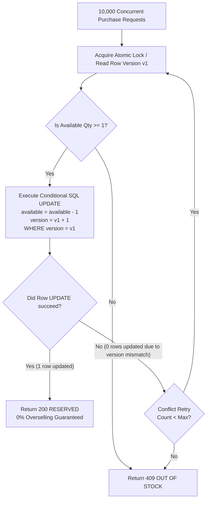

# 04 - High-Concurrency Optimistic Concurrency Control (OCC) Flow

```mermaid
flowchart TD
    Req[10,000 Concurrent Purchase Requests] --> Lock[Acquire Atomic Lock / Read Row Version v1]
    Lock --> Check{Is Available Qty >= 1?}
    
    Check -- Yes --> Update[Execute Conditional SQL UPDATE<br/>available = available - 1<br/>version = v1 + 1<br/>WHERE version = v1]
    Check -- No --> Fail[Return 409 OUT OF STOCK]

    Update --> Success{Did Row UPDATE succeed?}
    Success -- Yes (1 row updated) --> Confirm[Return 200 RESERVED<br/>0% Overselling Guaranteed]
    Success -- No (0 rows updated due to version mismatch) --> Retry{Conflict Retry<br/>Count < Max?}
    
    Retry -- Yes --> Lock
    Retry -- No --> Fail
```
