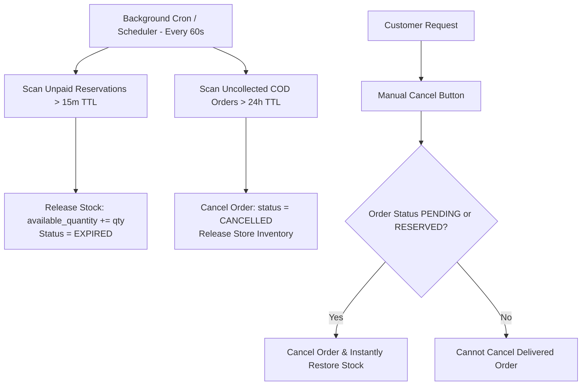

# 05 - Automated Cancellation & Stock Expiry Engine Diagram

```mermaid
flowchart TD
    Cron[Background Cron / Scheduler - Every 60s] --> ScanRes[Scan Unpaid Reservations > 15m TTL]
    ScanRes --> Release[Release Stock: available_quantity += qty<br/>Status = EXPIRED]
    
    Cron --> ScanCOD[Scan Uncollected COD Orders > 24h TTL]
    ScanCOD --> CancelCOD[Cancel Order: status = CANCELLED<br/>Release Store Inventory]
    
    Customer[Customer Request] --> ManualCancel[Manual Cancel Button]
    ManualCancel --> CheckStatus{Order Status PENDING or RESERVED?}
    CheckStatus -- Yes --> UserCancel[Cancel Order & Instantly Restore Stock]
    CheckStatus -- No --> Reject[Cannot Cancel Delivered Order]
```
