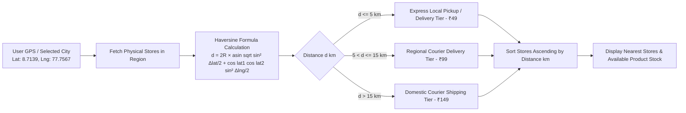

# 06 - Location Proximity & Haversine Distance Sorting Diagram

```mermaid
flowchart LR
    UserLoc[User GPS / Selected City<br/>Lat: 8.7139, Lng: 77.7567] --> FetchStores[Fetch Physical Stores in Region]
    FetchStores --> Calc[Haversine Formula Calculation<br/>d = 2R × asin sqrt sin² Δlat/2 + cos lat1 cos lat2 sin² Δlng/2]
    
    Calc --> TierCheck{Distance d km}
    TierCheck -- d <= 5 km --> Tier1[Express Local Pickup / Delivery Tier - ₹49]
    TierCheck -- 5 < d <= 15 km --> Tier2[Regional Courier Delivery Tier - ₹99]
    TierCheck -- d > 15 km --> Tier3[Domestic Courier Shipping Tier - ₹149]
    
    Tier1 --> Sort[Sort Stores Ascending by Distance km]
    Tier2 --> Sort
    Tier3 --> Sort
    Sort --> UI[Display Nearest Stores & Available Product Stock]
```
