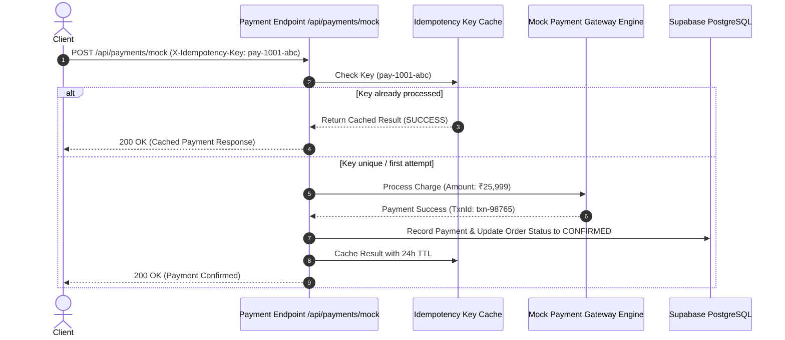

# 07 - Payment Gateway & Idempotency Key Processing Diagram

```mermaid
sequenceDiagram
    autonumber
    actor Client
    participant API as Payment Endpoint /api/payments/mock
    participant IdemCache as Idempotency Key Cache
    participant Gateway as Mock Payment Gateway Engine
    participant DB as Supabase PostgreSQL

    Client->>API: POST /api/payments/mock (X-Idempotency-Key: pay-1001-abc)
    API->>IdemCache: Check Key (pay-1001-abc)
    alt Key already processed
        IdemCache-->>API: Return Cached Result (SUCCESS)
        API-->>Client: 200 OK (Cached Payment Response)
    else Key unique / first attempt
        API->>Gateway: Process Charge (Amount: ₹25,999)
        Gateway-->>API: Payment Success (TxnId: txn-98765)
        API->>DB: Record Payment & Update Order Status to CONFIRMED
        API->>IdemCache: Cache Result with 24h TTL
        API-->>Client: 200 OK (Payment Confirmed)
    end
```
