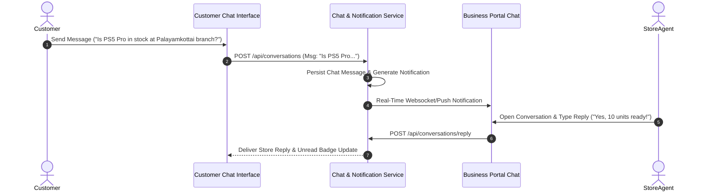

# 08 - Real-Time Customer-Store Chat & Notification Flow Diagram

```mermaid
sequenceDiagram
    autonumber
    actor Customer
    participant ChatUI as Customer Chat Interface
    participant ChatSvc as Chat & Notification Service
    participant StoreUI as Business Portal Chat
    actor StoreAgent

    Customer->>ChatUI: Send Message ("Is PS5 Pro in stock at Palayamkottai branch?")
    ChatUI->>ChatSvc: POST /api/conversations (Msg: "Is PS5 Pro...")
    ChatSvc->>ChatSvc: Persist Chat Message & Generate Notification
    ChatSvc->>StoreUI: Real-Time Websocket/Push Notification
    StoreAgent->>StoreUI: Open Conversation & Type Reply ("Yes, 10 units ready!")
    StoreUI->>ChatSvc: POST /api/conversations/reply
    ChatSvc-->>ChatUI: Deliver Store Reply & Unread Badge Update
```
