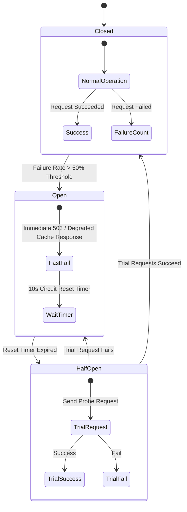

# 10 - Circuit Breaker & Resilience State Diagram

```mermaid
stateDiagram-v2
    [*] --> Closed

    state Closed {
        [*] --> NormalOperation
        NormalOperation --> Success: Request Succeeded
        NormalOperation --> FailureCount: Request Failed
    }

    Closed --> Open: Failure Rate > 50% Threshold
    
    state Open {
        [*] --> FastFail: Immediate 503 / Degraded Cache Response
        FastFail --> WaitTimer: 10s Circuit Reset Timer
    }

    Open --> HalfOpen: Reset Timer Expired

    state HalfOpen {
        [*] --> TrialRequest: Send Probe Request
        TrialRequest --> TrialSuccess: Success
        TrialRequest --> TrialFail: Fail
    }

    HalfOpen --> Closed: Trial Requests Succeed
    HalfOpen --> Open: Trial Request Fails
```
