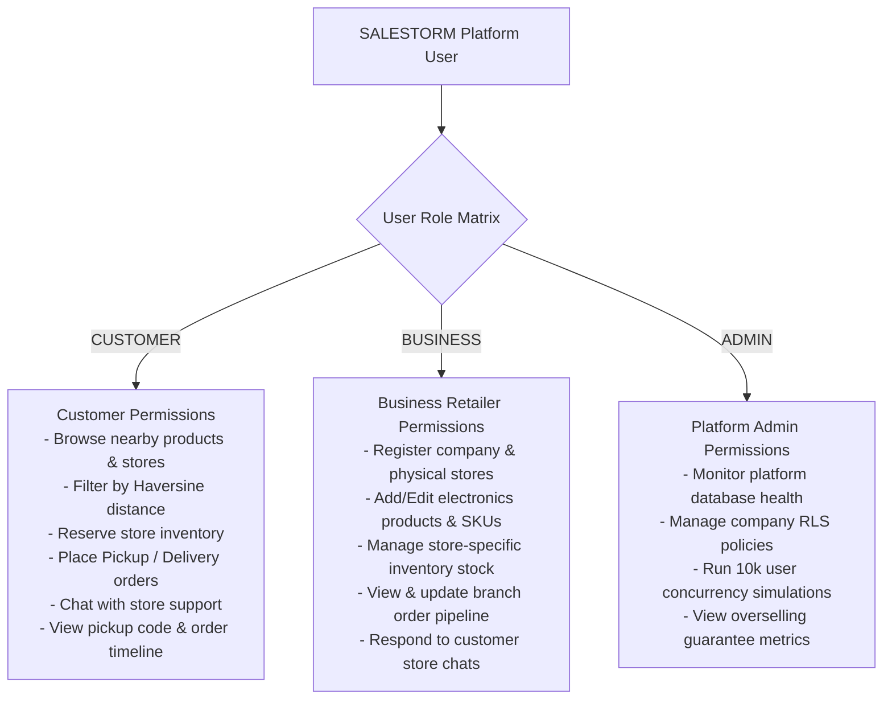

# 11 - User Role & Permission Matrix Diagram

```mermaid
graph TD
    User[SALESTORM Platform User] --> Role{User Role Matrix}

    Role -- CUSTOMER --> CustPerms[Customer Permissions<br/>- Browse nearby products & stores<br/>- Filter by Haversine distance<br/>- Reserve store inventory<br/>- Place Pickup / Delivery orders<br/>- Chat with store support<br/>- View pickup code & order timeline]

    Role -- BUSINESS --> BizPerms[Business Retailer Permissions<br/>- Register company & physical stores<br/>- Add/Edit electronics products & SKUs<br/>- Manage store-specific inventory stock<br/>- View & update branch order pipeline<br/>- Respond to customer store chats]

    Role -- ADMIN --> AdminPerms[Platform Admin Permissions<br/>- Monitor platform database health<br/>- Manage company RLS policies<br/>- Run 10k user concurrency simulations<br/>- View overselling guarantee metrics]
```
