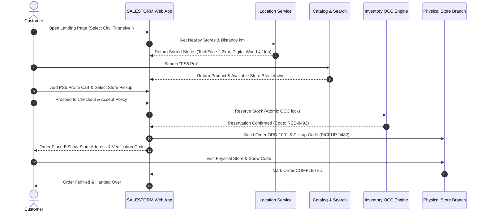

# 12 - Complete End-to-End Customer Journey Sequence Diagram

```mermaid
sequenceDiagram
    autonumber
    actor Customer
    participant App as SALESTORM Web App
    participant Loc as Location Service
    participant Cat as Catalog & Search
    participant Inv as Inventory OCC Engine
    participant Store as Physical Store Branch

    Customer->>App: Open Landing Page (Select City: Tirunelveli)
    App->>Loc: Get Nearby Stores & Distance km
    Loc-->>App: Return Sorted Stores (TechZone 2.3km, Digital World 4.1km)
    
    Customer->>Cat: Search "PS5 Pro"
    Cat-->>App: Return Product & Available Store Breakdown
    
    Customer->>App: Add PS5 Pro to Cart & Select Store Pickup
    Customer->>App: Proceed to Checkout & Accept Policy
    
    App->>Inv: Reserve Stock (Atomic OCC lock)
    Inv-->>App: Reservation Confirmed (Code: RES-8492)
    
    App->>Store: Send Order ORD-1001 & Pickup Code (PICKUP-9482)
    App-->>Customer: Order Placed! Show Store Address & Verification Code
    
    Customer->>Store: Visit Physical Store & Show Code
    Store->>App: Mark Order COMPLETED
    App-->>Customer: Order Fulfilled & Handed Over
```
